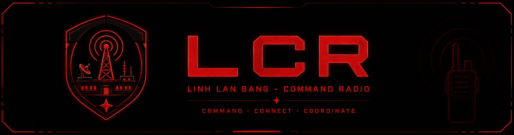

<p align="center">
  
</p>

# LCR — Linh Lan Bang Command Radio

> **COMMAND — CONNECT — COORDINATE**

LCR là hệ thống **Command Radio trên Discord** của Linh Lan Bang, giúp Commander và các Unit Leader liên lạc giữa nhiều voice channel mà không cần gom toàn bộ raid vào một phòng.

> **Tài liệu này dành cho thành viên/guildmate sử dụng LCR.**  
> Không cần cài đặt hay tự vận hành server. Phần server do staff LLB quản lý.

> **Lưu ý phiên bản:** README này mô tả hệ thống LCR đang được LLB sử dụng hiện tại. Bản public release `v0.0.1-beta` có thể chưa chứa đầy đủ các mode/chức năng mới được mô tả bên dưới.

---

## 1. LCR hoạt động như thế nào?

Mô hình cơ bản:

```text
                    COMMAND CHANNEL
                 Commander / Command Staff
                           |
              +------------+------------+
              |            |            |
           UNIT 1        UNIT 2       UNIT 3 ...
         Speaker 1      Speaker 2     Speaker 3
            |
       Unit Leader
       + members
```

Trong **Command Radio** và **PTT Radio**:

- Commander làm việc trong **Command Channel**.
- Mỗi Unit có voice channel riêng và một **Speaker bot** riêng.
- Unit Leader nói chuyện bình thường với Unit của mình bằng Discord như bình thường.
- Khi cần liên lạc xuyên channel, LCR sử dụng **Radio Key / PTT**.
- **Không có Unit-to-Unit relay**: Unit 1 không trực tiếp phát sang Unit 2/3/4.

---

## 2. Ai cần dùng LCR Helper?

### Commander

- Trong **Command Radio**: **không cần Helper** để phát lệnh xuống các Unit.
- Trong **PTT Radio**: cần pair Helper và giữ Radio Key khi muốn phát xuống các Unit.

### Unit Leader

Unit Leader cần Helper khi muốn sử dụng radio xuyên channel:

- đang ở Unit → PTT lên Command;
- đang ở Command → PTT xuống toàn bộ Unit.

### Thành viên bình thường

Không cần cài Helper.

Chỉ cần vào đúng Unit voice channel và nói chuyện bằng Discord bình thường.

---

## 3. Cài và pair LCR Helper

Guildmate chỉ cần file **`LCR.exe`** từ mục Releases hoặc file do staff LLB cung cấp.

**Không cần `LCR-Server.zip`.** Phần đó không dành cho thành viên sử dụng thông thường.

### Pair lần đầu

1. Mở `LCR.exe`.
2. Trong Discord chạy:

   ```text
   /radio-pair
   ```

3. Bot sẽ cấp một Pair Code ngắn hạn.
4. Nhập code đó vào LCR Helper ngay.
5. Chọn Radio Key mong muốn. Mặc định thường là **Mouse5**.
6. Khi Helper báo **Standby / Connected**, radio đã sẵn sàng.

### Pair Code có các quy tắc sau

- Code chỉ dùng **một lần**.
- Code có thời hạn ngắn; hãy nhập ngay sau khi tạo.
- Code gắn với **đúng Discord account đã tạo code**.
- Không chia sẻ Pair Code cho người khác.
- Nếu pair bằng code của account khác, radio của account hiện tại sẽ **không được mở**.

Nếu Helper báo `Invalid / Expired`, tạo một code mới bằng `/radio-pair` và pair lại.

---

## 4. Radio Key / trạng thái Helper

Thông thường:

- **Xám / Disconnected** → chưa kết nối được với LCR.
- **Xanh / Standby** → đã pair, radio đang đóng.
- **Đỏ / Transmitting** → đang giữ Radio Key và radio đang mở.

Radio hoạt động theo kiểu **hold-to-transmit**:

```text
Giữ Radio Key  -> mở radio
Nhả Radio Key  -> đóng radio
```

Nhả phím là uplink/downlink sẽ đóng ngay; không cần bấm thêm nút khác.

---

# 5. Các mode của LCR

## A. Command Radio — mode khuyến nghị cho raid LLB

Đây là mode Command Radio chính của LCR.

### Commander đang ở Command Channel

**Không giữ PTT:**

```text
Commander
   ↓
Command Channel
   ↓
Unit 1 + Unit 2 + Unit 3 + Unit 4 ...
```

Commander nói bình thường và tất cả Unit đã cấu hình sẽ nghe.

Commander **không cần Helper** trong mode này.

### Unit Leader đang ở Unit của mình

**Không giữ PTT:**

```text
Unit Leader → Unit của mình בלבד
```

Command không nghe.

**Giữ PTT:**

```text
Unit Leader
   ├─> Unit của mình
   └─> Command Channel
```

Nhả PTT → uplink lên Command đóng lại.

### Unit Leader di chuyển lên Command Channel

Unit Leader **không cần đổi role hoặc pair lại** chỉ vì đổi phòng.

**Không giữ PTT:**

```text
Unit Leader → Command Channel בלבד
```

Các Unit không nghe relay.

**Giữ PTT:**

```text
Unit Leader @ Command
   ↓
Unit 1 + Unit 2 + Unit 3 + Unit 4 ...
```

Nhả PTT → downlink xuống các Unit đóng lại.

### Quy tắc quan trọng

```text
Unit 1 -X-> Unit 2
Unit 1 -X-> Unit 3
Unit 2 -X-> Unit 4
```

Không có Unit-to-Unit relay.

---

## B. PTT Radio — mọi liên lạc xuyên channel đều cần PTT

PTT Radio dành cho tình huống muốn radio có tính kỷ luật cao hơn: **không ai vô tình broadcast xuyên channel chỉ vì đang nói**.

### Commander @ Command

**Không giữ PTT:**

```text
Commander → Command Channel בלבד
```

Các Unit không nghe relay.

**Giữ PTT:**

```text
Commander
   ↓
Unit 1 + Unit 2 + Unit 3 + Unit 4 ...
```

Nhả PTT → downlink đóng.

### Unit Leader @ Unit

**Không giữ PTT:** chỉ Unit của mình nghe.

**Giữ PTT:** Unit của mình + Command nghe.

### Unit Leader @ Command

**Không giữ PTT:** chỉ người trong Command nghe.

**Giữ PTT:** toàn bộ Unit đã cấu hình nghe.

### Điểm khác Command Radio

```text
Command Radio
Commander downlink = Free Mic
Unit Leader cross-channel = PTT

PTT Radio
Commander cross-channel = PTT
Unit Leader cross-channel = PTT
```

Nếu Commander hay Command Staff muốn tránh accidental broadcast, dùng **PTT Radio**.

---

# 6. Legacy Modes

Các mode dưới đây được giữ lại để tương thích và dùng cho tình huống đặc biệt. Với raid LLB thông thường, ưu tiên **Command Radio** hoặc **PTT Radio**.

## One Caller

Một caller trung tâm phát tới các Speaker/room đã bind.

```text
Caller
 ├─> Room 1
 ├─> Room 2
 └─> Room 3
```

Phù hợp khi chỉ cần **một chiều từ caller xuống nhiều room**.

---

## Many Callers

Nhiều caller/room đủ điều kiện có thể được relay/mix với nhau.

Mode này có thể tạo **cross-talk giữa nhiều room**, bao gồm Unit-to-Unit tùy cấu hình.

Chỉ dùng khi raid leader/staff chủ động yêu cầu.

---

## One ↔ Many

Mô hình star hai chiều kiểu legacy:

```text
              Center
             /  |  \
            /   |   \
         Unit1 Unit2 Unit3
```

- Center → tất cả Unit.
- Mỗi Unit → Center.
- Unit không nghe trực tiếp Unit khác.

Khác với Command Radio/PTT Radio, mode legacy này không dùng cùng mô hình radio-gate theo role/location của LCR mới.

---

# 7. Slash Commands

## `/radio-pair`

Tạo Pair Code cho LCR Helper.

Có thể dùng bởi người có role LCR được cấp quyền như:

- Commander;
- Unit Leader;
- hoặc người có cả hai role.

Người không có role phù hợp sẽ bị từ chối.

---

## `/setup`

Dùng để cấu hình Command Channel, Unit, role và Speaker bot.

**Guildmate bình thường không cần dùng lệnh này.**

Chỉ staff/người được giao setup nên thay đổi cấu hình.

---

## `/start`

Bắt đầu một phiên LCR.

Có thể chọn mode phù hợp, ví dụ:

- Command Radio;
- PTT Radio;
- các legacy mode.

Nếu chưa có Speaker phù hợp/ready, LCR có thể từ chối start thay vì chạy trong trạng thái lỗi.

Sau `/start`, chờ vài giây để các bot vào đúng voice channel trước khi bắt đầu call chính thức.

---

## `/status`

Xem trạng thái/cấu hình hiện tại của LCR.

Nếu có vấn đề về bot vào sai phòng hoặc raid không start được, dùng `/status` trước khi báo staff.

---

## `/stop`

Dừng phiên LCR hiện tại.

Sau khi `/stop`, muốn dùng radio lại phải `/start` một phiên mới.

---

# 8. Chọn mode nào?

### Raid/GvG thông thường

**Command Radio**

Commander có thể call liên tục xuống toàn bộ Unit; Unit Leader chỉ uplink khi chủ động giữ Radio Key.

### Muốn radio kỷ luật, tránh accidental broadcast

**PTT Radio**

Mọi cross-channel communication đều cần giữ PTT.

### Event/flow cũ hoặc setup đặc biệt

Dùng **One Caller / Many Callers / One ↔ Many** khi raid leader hoặc staff yêu cầu.

---

# 9. Troubleshooting nhanh

### Helper báo `Invalid / Expired`

- Tạo Pair Code mới bằng `/radio-pair`.
- Nhập ngay.
- Không dùng lại code cũ.

### Helper đã pair nhưng PTT không phát

Kiểm tra:

- Helper đang **Connected / Standby**;
- Radio Key đúng;
- Pair được tạo bởi **đúng Discord account đang nói**;
- bạn có Commander hoặc Unit Leader Role phù hợp.

### Bot chưa vào đủ room sau `/start`

Chờ vài giây rồi kiểm tra `/status`.

Nếu vẫn sai, báo staff thay vì tự sửa `/setup` khi bạn không phụ trách cấu hình.

### `/start` không chạy

Có thể chưa có Speaker bot phù hợp hoặc setup chưa đủ điều kiện. Đây là fail-safe bình thường; báo staff kiểm tra.

### Không chắc đang dùng mode nào

Dùng `/status` hoặc hỏi Commander/staff trước khi raid bắt đầu.

---

# 10. Quy tắc radio ngắn gọn

```text
COMMAND RADIO
Commander @ Command: nói bình thường -> tất cả Unit
Leader @ Unit:        nói bình thường -> own Unit
Leader @ Unit + PTT:  own Unit + Command
Leader @ Command:     nói bình thường -> Command only
Leader @ Command+PTT: tất cả Unit

PTT RADIO
Commander @ Command: nói bình thường -> Command only
Commander + PTT:     tất cả Unit
Leader @ Unit + PTT: Command
Leader @ Command+PTT:tất cả Unit

COMMAND/PTT RADIO
Unit -> Unit: KHÔNG
```

---

**LCR — Linh Lan Bang Command Radio**  
**COMMAND — CONNECT — COORDINATE**
